# 🏢 Enterprise Asset Management System (EAM)

A modern **Enterprise Asset Management System** designed to manage asset lifecycle, monitor performance, and support data-driven decision making.

---

## 🚀 Features

* 📊 **Dashboard Analytics** — real-time asset metrics, financial insights, and activity logs
* 📦 **Asset Management** — QR-based tracking, smart search, and lifecycle monitoring
* 🔄 **Asset Transfer** — location & ownership mutation with history tracking
* 📚 **Loan System** — asset borrowing, return validation, and SLA status
* 🛠️ **Maintenance** — asset health scoring & repair recommendations (DSS)
* 🗑️ **Disposal** — asset write-off with residual value tracking
* 🧱 **Master Data** — manage locations, categories, and asset ownership
* 🔐 **Admin & Security** — audit trail, user management, and role-based access

---

## 🛠️ Tech Stack

* **Frontend**: Android (Java)
* **Backend**: PHP (REST API)
* **Database**: MySQL

---

## 📂 Structure

```bash
backend/    # API & business logic
frontend/   # Android application
```

---

## 📸 Preview

<p align="center">
  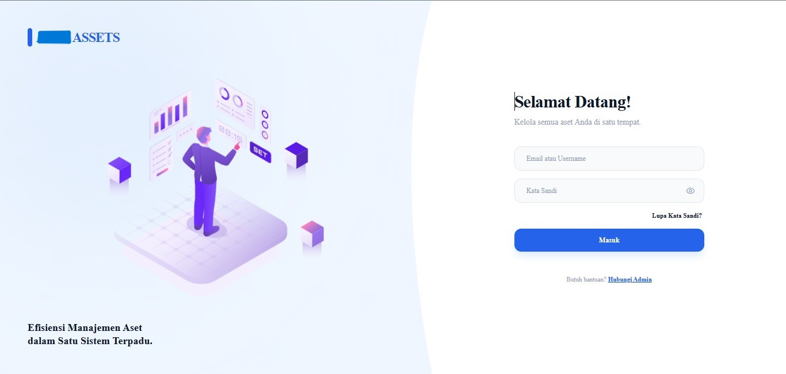
  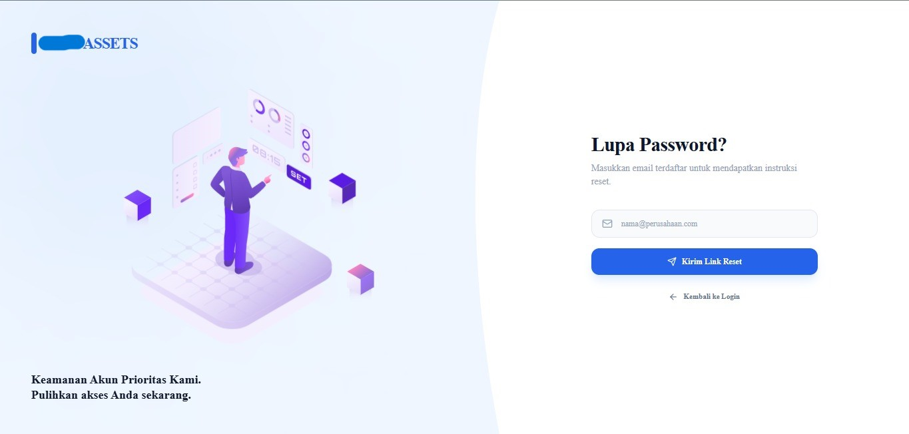
  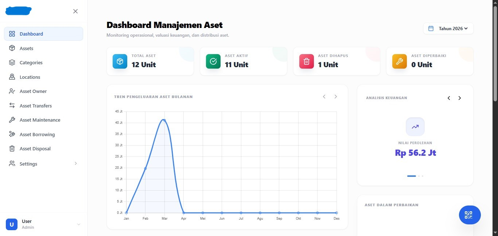
</p>

<p align="center">
  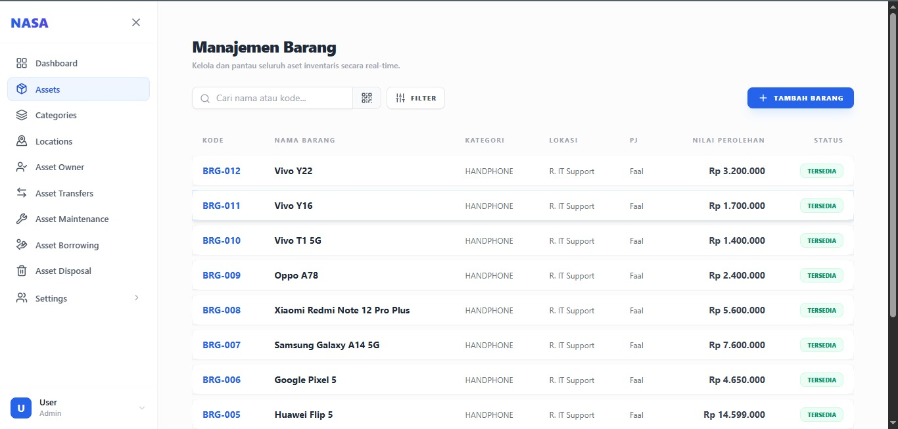
  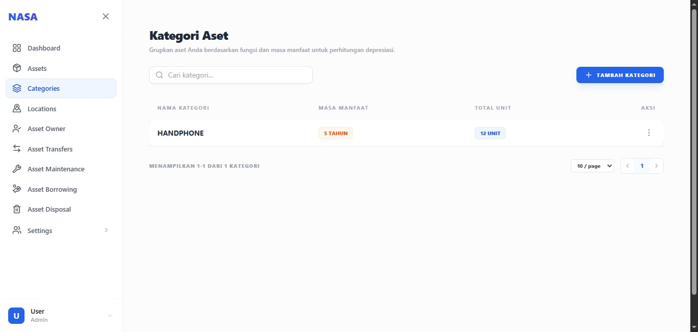
  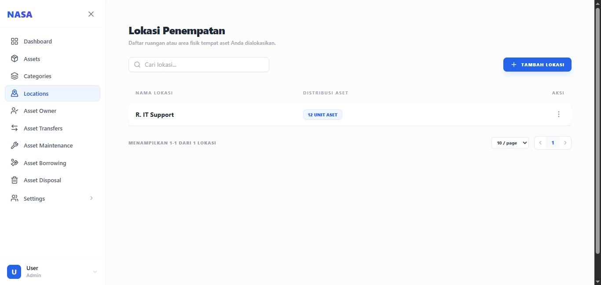
</p>

<p align="center">
  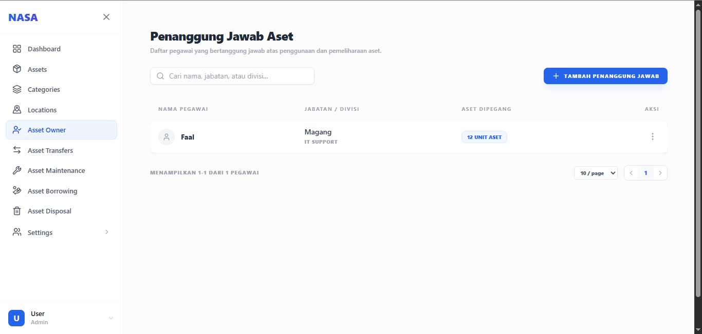
  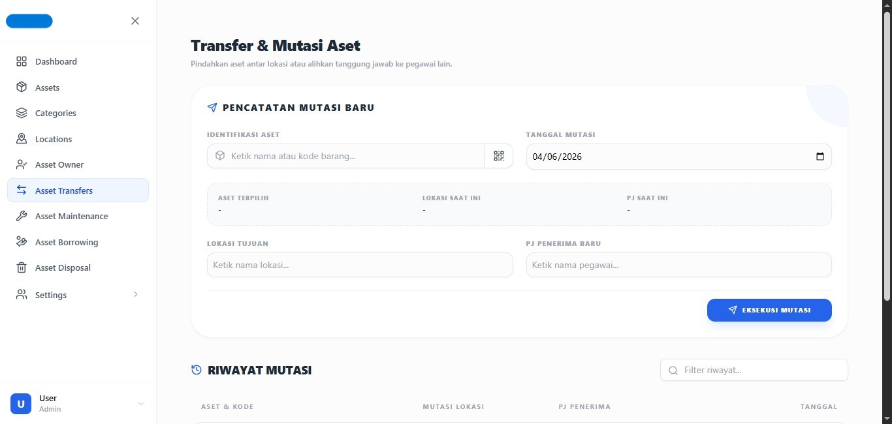
  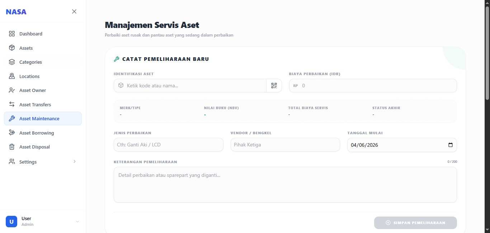
</p>

<p align="center">
  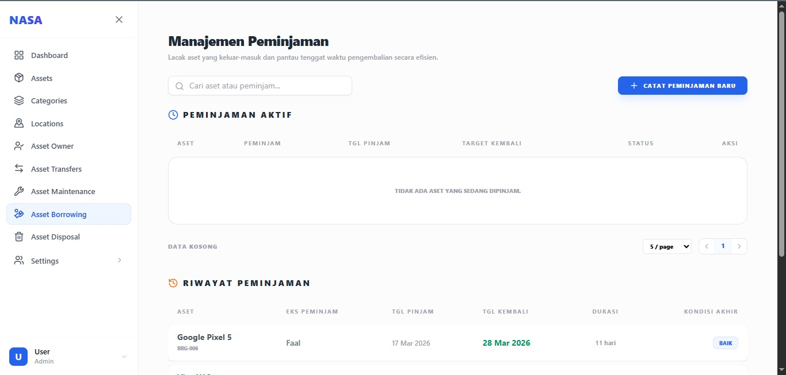
  
  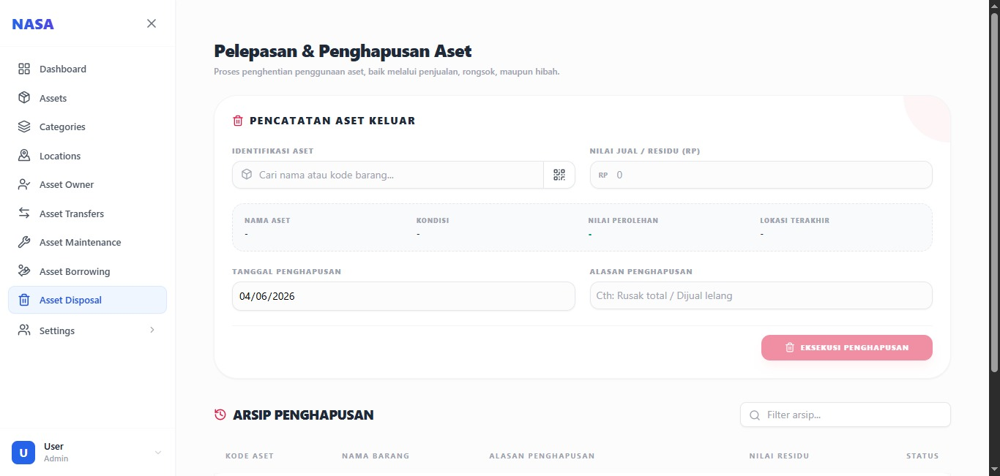
</p>

<p align="center">
  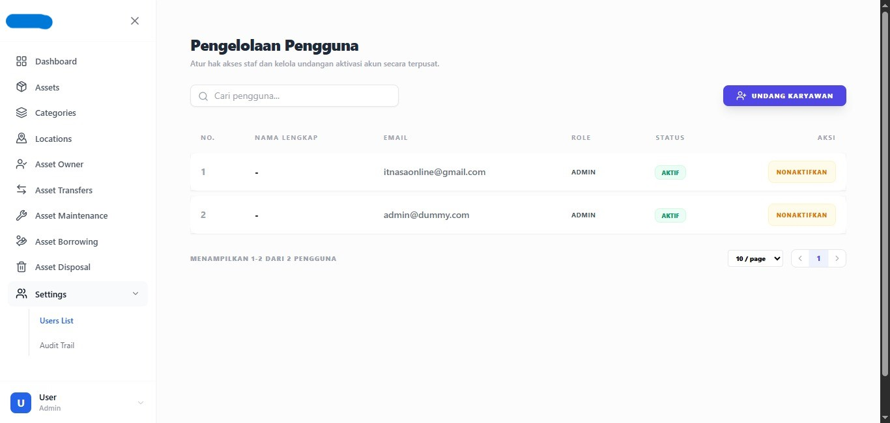
  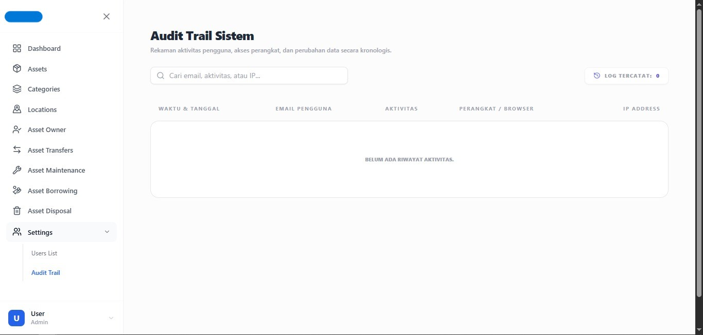
</p>

---

## 🎯 Highlights

* Full asset lifecycle management
* Integrated analytics & financial tracking
* Decision Support System (DSS)
* QR-based real-world integration

---

## 👨‍💻 Author

Developed by **Your Name**
